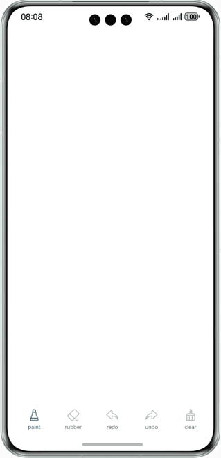

# Custom Canvas

### Overview

This sample demonstrates a feature-rich custom canvas application built with the **Canvas** component, supporting multiple brush types (ballpoint pen, marker, fountain pen), color selection with grid/RGB slider switching, drawing tools (ruler, compass, rectangle), compass arc drawing, brush thickness and opacity adjustment, undo/redo, clear, and two-finger zoom. It uses a dual-layer Canvas incremental rendering architecture for smooth performance even with many strokes. The app icon features an elegant SVG vector design (fountain pen + color palette).

### Preview



### How to Use

1. On the home page, there are six icons at the bottom: pen, shape tools, eraser, undo, redo, and clear. The pen is selected by default, allowing you to draw in the empty space. Default thickness is 3 with opaque black color.
2. Touch the pen icon to display a semi-modal menu where you can choose the brush type (ballpoint pen, marker, fountain pen), color (grid/RGB slider switching), opacity, and thickness.
3. The ballpoint pen is the default brush with fixed 100% opacity. The marker defaults to 50% opacity and can be freely adjusted. The fountain pen supports velocity-sensitive variable-width stroke effects.
4. Color selection supports two switchable modes: **Color Grid** (10-column grayscale bar + 9×10 color grid) and **RGB Slider** (R/G/B sliders 0-255). Touch the blue text next to the "Color" title to switch modes. The two modes are bidirectionally synchronized.
5. Touch the shape tools icon to display the shape tools panel, where you can select ruler (draw lines), compass (draw circles/arcs), or rectangle (draw rectangles).
   - **Compass**: First touch+drag draws a full circle; second touch+drag draws an arc (touchscreen-friendly interaction).
   - After selecting a shape tool, drag on the canvas to draw the corresponding shape. Touch the button again to cancel and resume free drawing.
6. Thickness adjustment uses a slider (range 3-21) with the current value displayed on the right.
7. After drawing, the undo icon is highlighted. Touch it to undo the last stroke. The redo icon is then highlighted to reverse the undo.
8. Touch the eraser icon to erase by drawing. Touch the clear icon to clear the entire canvas.
9. Use a pinch gesture with two fingers to zoom in or out. Drawing is disabled during zoom.

### Project Directory

```
├──entry/src/main/ets/
│  ├──common
│  │  └──CommonConstants.ets         // Common constants + color grid generation
│  ├──entryability
│  │  └──EntryAbility.ets            // Entry ability
│  ├──pages                  
│  │  └──Index.ets                   // Home page (dual Canvas + toolbar + shape panel + compass)
│  ├──view   
│  │  └──myPaintSheet.ets            // Semi-modal page (brush/grid/RGB/opacity/thickness)
│  └──viewmodel
│     ├──DrawInvoker.ets             // Drawing method (undo/redo/execute)
│     ├──IBrush.ets                  // Brush APIs + NormalBrush + FountainPenBrush
│     ├──IDraw.ets                   // Drawing class + DrawPath + ShapeDraw (line/arc/rect)
│     └──Paint.ets                   // Drawing property class
└──entry/src/main/resources
   └──base/media
      ├──foreground.svg              // App icon foreground (pen + palette)
      ├──background.svg              // App icon background (blue gradient)
      ├──startIcon.svg               // Launch icon (composite)
      └──layered_image.json          // Layered icon config
```

### How to Implement

1. **Dual-layer Canvas architecture**: The bottom Canvas displays committed path snapshots (white background), while the top Canvas only renders the current stroke preview (transparent background). During Move, there is no need to traverse historical paths, reducing performance from O(N) to O(1).
2. **Incremental rendering**: On TouchUp, only the new path is appended to the bottom Canvas without redrawing all history. Full redraw occurs only on undo/redo/clear.
3. **Fountain pen variable-width rendering**: FountainPenBrush tracks touch velocity — slow → thick, fast → thin — using quadratic Bézier curves for smooth strokes with tapered ends.
4. **Shape tools**: ShapeDraw supports lines (two-point connection), circles/arcs (center + radius + start/end angles), and rectangles (diagonal vertices), accessible via a dedicated bottom button panel.
5. **Compass arc**: ShapeDraw adds startAngle/endAngle properties. First TouchDown+Move draws a full circle; second TouchDown+Move draws an arc, adapting to touchscreen without right-click.
6. **Dual color selection modes**: The colorMode state controls switching between color grid and RGB sliders. The grid includes a grayscale bar and HSL color grid. RGB sliders synthesize HEX color in real-time. Both modes are bidirectionally synchronized via syncRgbFromColor/updateColorFromRgb.
7. **Eraser** is implemented by setting strokeStyle to white. Each path saves an independent Paint snapshot, so modifying brush properties does not affect existing drawings.
8. Undo moves the last item from drawPathList to redoList; redo moves it back. Clear empties both lists and redraws.
9. **SVG vector icon**: The app icon uses SVG vector design with a fountain pen + color palette foreground and a blue gradient rounded rectangle background, supporting lossless scaling at any size.

### Required Permissions

N/A

### Constraints

1. The sample app is supported only on Huawei phones running the standard system.

2. The HarmonyOS version must be HarmonyOS 5.0.5 Release or later.

3. The DevEco Studio version must be DevEco Studio 5.0.5 Release or later.

4. The HarmonyOS SDK version must be HarmonyOS 5.0.5 Release SDK or later.
