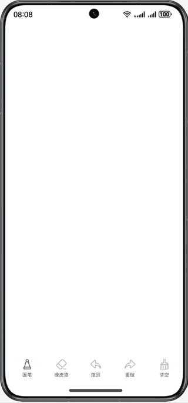

# 基于Canvas实现画布的功能

### 介绍

本示例通过Canvas实现了一个功能丰富的画布应用，支持多种笔刷（圆珠笔、马克笔、钢笔）、网格选色/RGB三色滑块选色切换、作图工具（直尺、圆规、矩形）、圆规圆弧、画笔粗细和不透明度调节、撤销/重做、清空、双指缩放等功能。采用双层Canvas增量渲染架构，确保大量笔画下依然流畅。应用图标采用精美SVG矢量设计（钢笔+调色板）。

### 效果图预览



##### 使用说明

1. 进入首页后，下方有六个按钮：画笔、作图工具、橡皮擦、撤回、重做、清空。画笔默认选中，可以在空白部分进行绘画，默认粗细是3，颜色是黑色不透明。
2. 点击画笔按钮，弹出半模态弹窗，可选择笔刷类型（圆珠笔、马克笔、钢笔）、颜色（网格选色/RGB滑块切换）、不透明度和粗细。
3. 圆珠笔为默认笔刷，不透明度固定100%；马克笔默认不透明度50%，可自由调节；钢笔支持速度感知的变宽笔锋效果。
4. 颜色选择支持两种模式切换：**网格选色**（10列灰度条 + 9×10色彩网格）和**RGB滑块**（R/G/B三色滑块0-255），点击"颜色"标题旁的蓝色文字即可切换，两种模式双向同步。
5. 点击作图工具按钮，弹出作图工具面板，可选择直尺（画直线）、圆规（画圆/圆弧）、矩形（画矩形）。
   - **圆规**：第一次点击拖动画完整圆，第二次点击拖动画圆弧（支持触摸屏交互）。
   - 选择作图工具后拖动画布即可绘制对应形状，再次点击按钮取消作图工具恢复自由绘画。
6. 粗细调节使用滑块拖动，范围3~21，右侧显示当前数值。
7. 进行绘制后，撤回按钮高亮可点击，点击后撤回上一步笔画；重做按钮高亮可点击，点击后还原上一步撤销的笔画。
8. 点击橡皮擦按钮后，手指绘画实现擦除效果；点击清空按钮清空整个画布所有绘制。
9. 双指捏合画布缩小，双指外扩画布放大，缩放时不响应绘制操作。

### 工程目录

```
├──entry/src/main/ets/
│  ├──common
│  │  └──CommonConstants.ets         // 公共常量类 + 色彩网格生成函数
│  ├──entryability
│  │  └──EntryAbility.ets            // 程序入口类
│  ├──pages                  
│  │  └──Index.ets                   // 首页（双层Canvas + 工具栏 + 作图面板 + 圆规交互）
│  ├──view   
│  │  └──myPaintSheet.ets            // 半模态页面（笔刷/网格选色/RGB滑块/不透明度/粗细）
│  └──viewmodel
│     ├──DrawInvoker.ets             // 绘制方法（撤销/重做/执行）
│     ├──IBrush.ets                  // 笔刷接口 + NormalBrush + FountainPenBrush
│     ├──IDraw.ets                   // 绘制接口 + DrawPath + ShapeDraw（直线/圆弧/矩形）
│     └──Paint.ets                   // 绘制属性类
└──entry/src/main/resources
   └──base/media
      ├──foreground.svg              // 应用图标前景（钢笔+调色板）
      ├──background.svg              // 应用图标背景（蓝色渐变）
      ├──startIcon.svg               // 启动图标（完整合成）
      └──layered_image.json          // 分层图标配置
```

### 具体实现

1. **双层Canvas架构**：底层Canvas显示已提交路径快照（白色背景），顶层Canvas仅绘制当前笔画预览（透明背景），Move时无需遍历历史路径，性能从O(N)降到O(1)。
2. **增量渲染**：TouchUp时只将新路径追加到底层Canvas，不重绘全部历史，仅undo/redo/clear时才全量重绘。
3. **钢笔变宽渲染**：FountainPenBrush追踪触摸速度，慢速→粗笔、快速→细笔，使用二次贝塞尔曲线平滑笔触，首尾渐细。
4. **作图工具**：ShapeDraw支持直线（两点连线）、圆/圆弧（圆心+半径+起止角度）、矩形（对角顶点），通过底部独立按钮弹出选择面板。
5. **圆规圆弧**：ShapeDraw新增startAngle/endAngle属性，第一次TouchDown+Move画完整圆，第二次TouchDown+Move画圆弧，适配触摸屏无右键场景。
6. **颜色选择双模式**：colorMode状态控制网格选色与RGB滑块切换，网格选色包含灰度条和HSL色彩网格，RGB滑块实时合成HEX颜色，两种模式通过syncRgbFromColor/updateColorFromRgb双向同步。
7. **橡皮擦**通过修改strokeStyle为白色实现；每条路径保存独立的Paint快照，修改画笔属性不影响已绘制路径。
8. 撤回功能将drawPathList最后一项移入redoList，重做功能移回drawPathList，清空功能清空两个列表后重绘。
9. **SVG矢量图标**：应用图标采用SVG矢量设计，前景为钢笔+调色板，背景为蓝色渐变圆角矩形，支持任意缩放不失真。

### 相关权限

不涉及。

### 约束与限制

1. 本示例仅支持标准系统上运行，支持设备：华为手机。

2. HarmonyOS系统：HarmonyOS 5.0.5 Release及以上。

3. DevEco Studio版本：DevEco Studio 5.0.5 Release及以上。

4. HarmonyOS SDK版本：HarmonyOS 5.0.5 Release SDK及以上。
